

 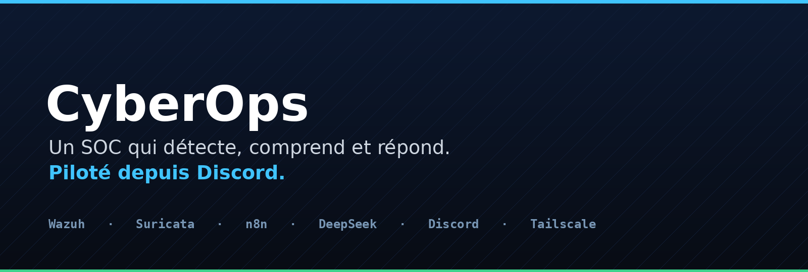

 <b>Un centre de sécurité qui détecte, comprend et répond.</b> 
 Détection en temps réel, analyse par IA, et réponse validée en un clic depuis Discord.

 
 
 
 
 
 

---

## En une phrase

Le bruit des alertes devient une décision simple, prise en un clic depuis Discord, puis appliquée toute seule sur les machines.

## Ce que fait CyberOps

| | |
|--|--|
| **Il détecte** | Brute force, scans réseau, malwares, modifications de fichiers. Rien ne passe inaperçu. |
| **Il comprend** | Une IA lit chaque alerte et rend un verdict clair : résumé, gravité, méthode employée, conseil. |
| **Il enquête** | Il croise chaque menace avec VirusTotal, AlienVault OTX, Hybrid Analysis et Shodan. |
| **Il prévient** | La menace arrive sur Discord, en carte lisible, à la seconde. |
| **Il demande l'accord** | Les actions qui bloquent attendent un clic Approuver ou Refuser. |
| **Il répond** | Bannir une IP, isoler une machine, mettre un fichier en quarantaine. Et tout annuler si besoin. |
| **Il obéit au chat** | On lui parle en français dans Discord, il agit. |

## La démo, trois attaques

### Attaque 1 : un fichier piégé

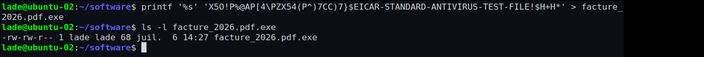

Un fichier malveillant est déposé sur une machine du parc, sous un nom d'apparence banale.

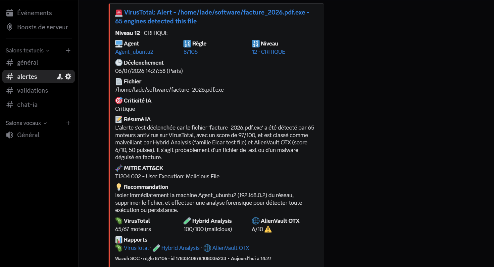

Le SOC le repère aussitôt et croise son empreinte avec VirusTotal, Hybrid Analysis et AlienVault OTX. Les trois rapports sont à un clic.

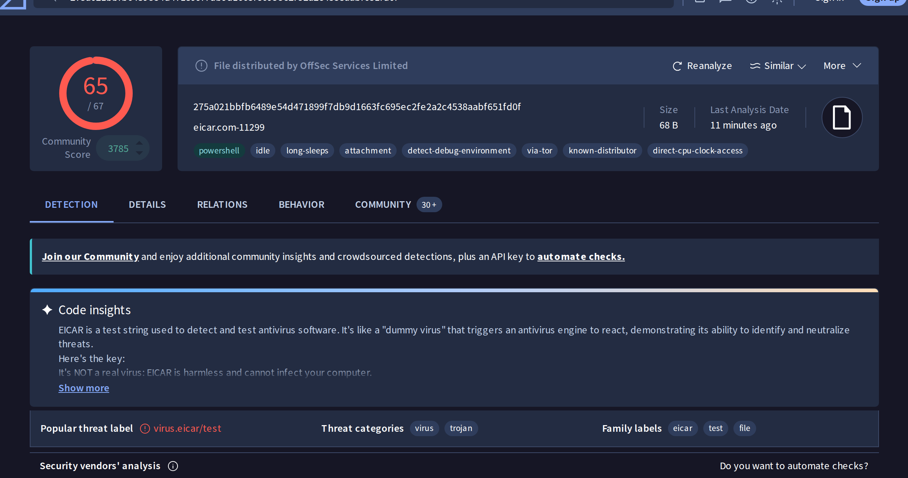

Un clic sur un lien ouvre le rapport complet. Ici VirusTotal, 65 moteurs sur 67. Les liens Hybrid Analysis et AlienVault OTX ouvrent de la même façon leurs analyses.

Puis on demande au SOC de le neutraliser, en langage naturel.

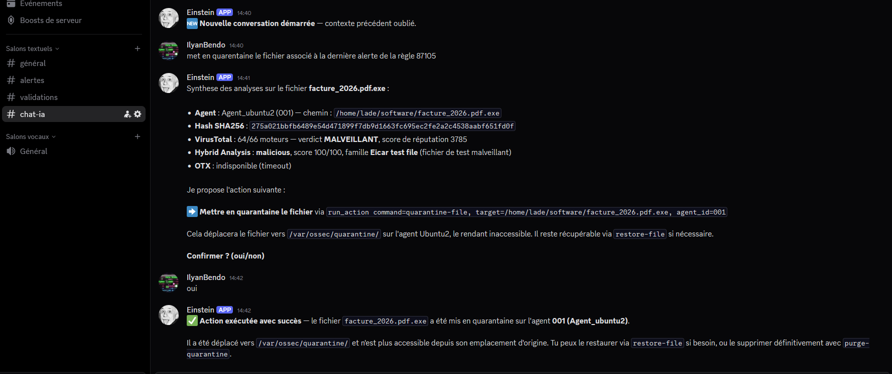

« Mets ce fichier en quarantaine. » C'est fait, sur la machine concernée.

### Attaque 2 : un brute force SSH

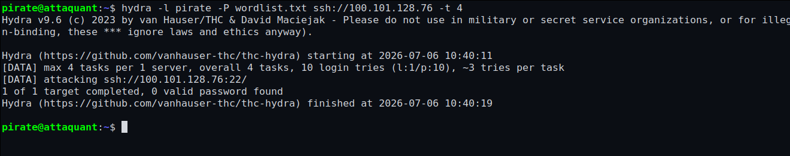

Une machine pirate tente de forcer un accès SSH sur un serveur du parc.

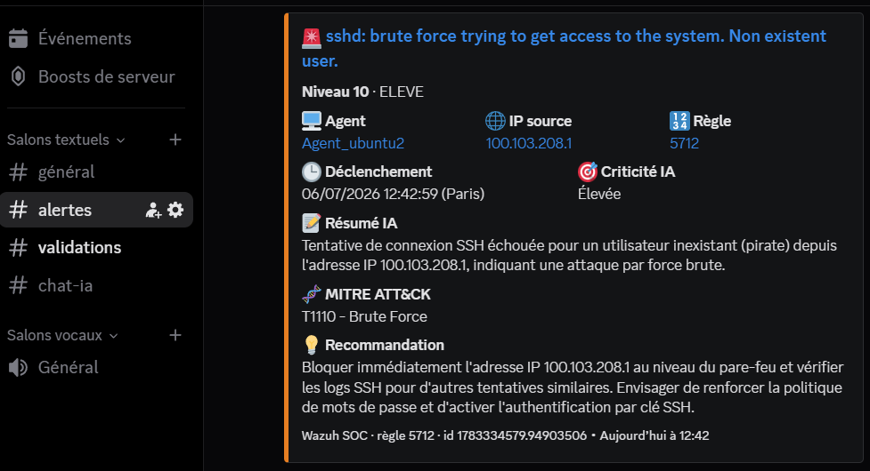

En quelques secondes, l'alerte arrive sur Discord, déjà analysée par l'IA.

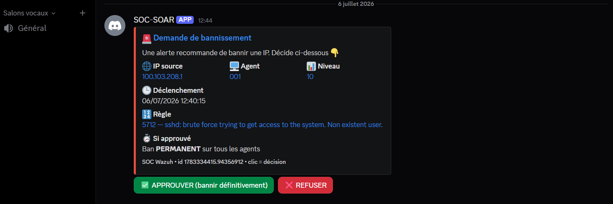

Action sensible : le SOC demande votre accord avant de bloquer. Aucune décision à l'aveugle.

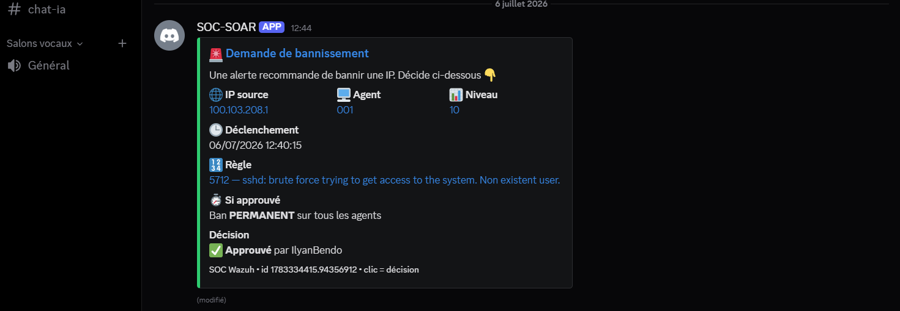

Un clic sur Approuver et l'IP est bloquée sur toutes les machines. L'attaquant est dehors.

### Attaque 3 : une adresse déjà fichée

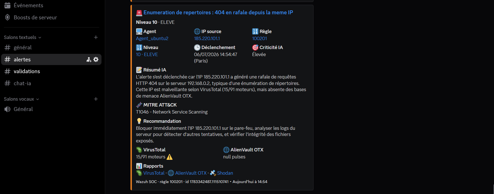

Une connexion vient d'une adresse publique déjà connue comme malveillante. Le SOC le voit et sort les rapports VirusTotal, OTX et Shodan.

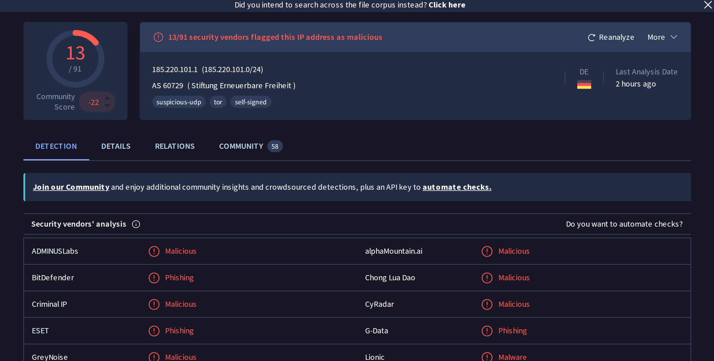

De la même façon pour l'adresse. Ici VirusTotal, 13 moteurs la signalent comme malveillante, avec l'étiquette tor. Les liens AlienVault OTX et Shodan ouvrent leurs rapports.

Puis on demande au SOC de contenir la menace.

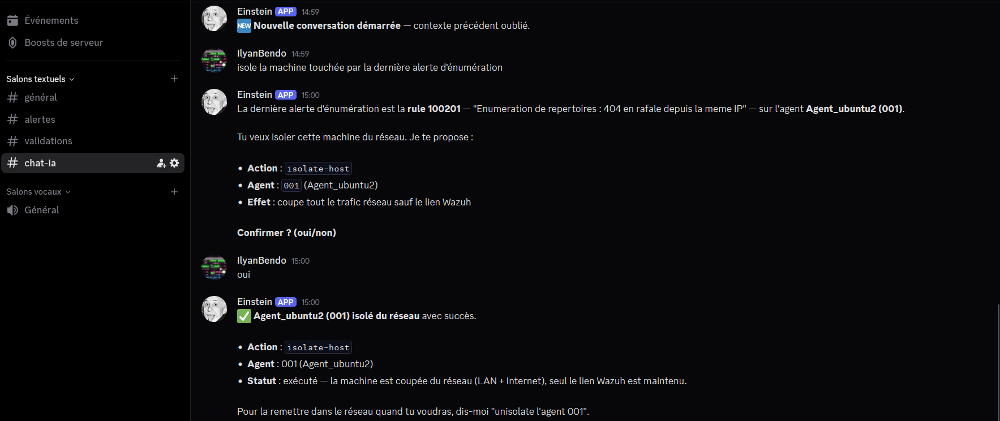

« Isole la machine touchée. » Elle est coupée du réseau, sauf du SOC, le temps d'enquêter.

## Vue d'ensemble

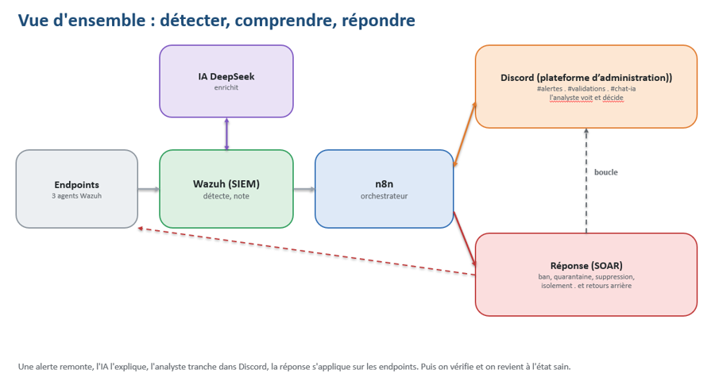

## La stack

Wazuh pour la détection, Suricata pour le réseau, n8n pour l'orchestration, DeepSeek pour l'IA, Discord pour le pilotage, Tailscale pour relier le tout. Trois machines, un seul cockpit.

## L'équipe

Ilyan · Thoma · Mathéo · EFREI Paris, matière SOC Overview.

## Documentation

Trois guides pas à pas accompagnent le projet : déploiement et détection, IA et réponse sur Discord, puis reconstruction de l'automatisation. À retrouver dans le dépôt.
